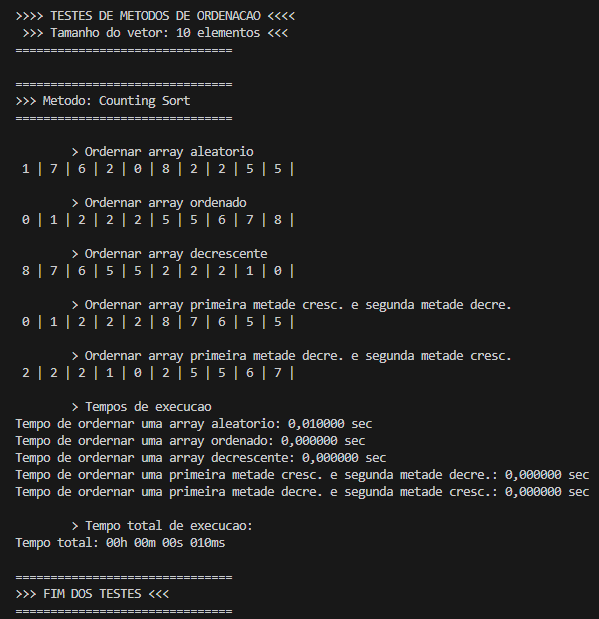

# Análise Comparativa de Algoritmos de Ordenação

Este projeto realiza uma análise comparativa abrangente de diversos algoritmos de ordenação, avaliando desempenho, estabilidade e parcialidade em diferentes cenários.

- 100 mil elementos.
- 500 mil elementos.
- 1 milhão de elementos.
- Ordenação de números aleatórios.
- Ordenação de números aleatórios já ordenados.
- Ordenação de núermos aleatório já ordenados decrescentemente.
- Ordenação de números aleatórios ordenados primeira metade crescente, segunda metade decrescente.
- Ordenação de números aleatórios ordenados primeira metade decrescente, segunda metade crescente.

## 📋 Sumário

- [Exemplo Prático](#exemplo-pratico)
- [Algoritmos de Ordenação](#algoritmos-de-ordenação)
- [Ambiente Computacional](#ambiente-computacional)
- [Estabilidade](#estabilidade)
- [Parcialidade](#parcialidade)
- [Tempo de Execução](#tempo-de-execução)
- [Análise de Desempenho](#análise-de-desempenho)
- [Conclusão](#conclusão)

## 🧪 Exemplo Prático

## 🔢 Algoritmos de Ordenação

### Definição
Os algoritmos de ordenação são estruturas lógicas que reorganizam elementos de uma estrutura de dados composta (como array ou vetor) para estabelecer uma sequência definida (crescente ou decrescente). São fundamentais para otimizar operações como busca e união de dados.

### Métodos Estudados
- **Insertion Sort**
- **Selection Sort**
- **Bubble Sort**
- **Comb Sort**
- **Quick Sort**
- **Merge Sort**
- **Shell Sort**
- **Heap Sort**
- **Radix Sort**
- **Counting Sort**
- **Bucket Sort**
- **Cocktail Sort**
- **Tim Sort**
- **Intro Sort**
- **Pancake Sort**
- **Pigeonhole Sort**

## 💻 Ambiente Computacional

Os testes foram realizados em condições controladas para garantir reprodutibilidade:

### Configurações do Sistema
- **Sistema Operacional**: Windows 10 Pro (22H2)
- **Processador**: Intel Core i5-6300U 2.4GHz
- **Memória RAM**: 4.00GB 2133 MHz

### Configurações do Software
- **IDE**: Visual Studio Code 1.105.1
- **Extensões**: C/C++ Extension Pack 1.3.1
- **Compilador**: GNU Compiler Collection (gcc) 6.3.0
- **Flags de Otimização**: Nenhuma (compilação padrão -o0)

## ⚖️ Estabilidade

### Definição
Um algoritmo de ordenação é considerado **estável** quando preserva a ordem relativa inicial de elementos com chaves iguais após a ordenação.

### Algoritmos Estáveis
- **Merge Sort** *
- **Insertion Sort**
- **Bubble Sort**
- **Counting Sort** *
- **Radix Sort** *
- **Tim Sort** *
- **Pigeonhole Sort** *
- **Cocktail Sort**
- **Bucket Sort**

> *Algoritmos que além de estáveis possuem melhor desempenho

## 📊 Parcialidade

### Definição
Algoritmos **parciais** permitem obter os 'n' primeiros elementos ordenados sem necessidade de ordenar o conjunto completo de dados.

### Algoritmos Parciais
- **Selection Sort**
- **Insertion Sort**
- **Heap Sort** *
- **Intro Sort** *

> *Algoritmos que além de parciais possuem melhor desempenho

## ⏱️ Tempo de Execução

### Análise do Tempo de Ordenação Total

| Método          | 100k         | 500k         | 1M             |
|-----------------|--------------|--------------|----------------|
| Counting Sort   | 010 ms       | 050 ms       | 055 ms         |
| Pigeonhole Sort | 021 ms       | 024 ms       | 058 ms         |
| Intro Sort      | 233 ms       | 226 ms       | 390 ms         |
| Radix Sort      | 120 ms       | 338 ms       | 616 ms         |
| Merge Sort      | 159 ms       | 359 ms       | 715 ms         |
| Quick Sort      | 068 ms       | 360 ms       | 776 ms         |
| Shell Sort      | 084 ms       | 395 ms       | 840 ms         |
| Comb Sort       | 076 ms       | 461 ms       | 895 ms         |
| Tim Sort        | 060 ms       | 307 ms       | 01s 161 ms     |
| Heap Sort       | 155 ms       | 805 ms       | 01s 618 ms     |
| Bucket Sort     | 528 ms       | 11s 807 ms   | 45s 538 ms     |
| Insertion Sort  | 29s 331 ms   | 11m 49s 208 ms | 47m 34s 809 ms |
| Selection Sort  | 01m 11s 849 ms | 25m 06s 160 ms | 01h 39m 24s 858 ms |
| Cocktail Sort   | 01m 09s 563 ms | 27m 18s 323 ms | 01h 49m 31s 968 ms |
| Bubble Sort     | 01m 34s 868 ms | 40m 07s 480 ms | 02h 38m 21s 353 ms |
| Pancake Sort    | 02m 14s 614 ms | 53m 57s 641 ms | 03h 34m 51s 130 ms |

## 📈 Análise de Desempenho

Com base nos testes realizados, os algoritmos foram categorizados em três grupos:

### 🟢 Alta Performance
- Counting Sort
- Pigeonhole Sort
- Intro Sort
- Radix Sort
- Merge Sort
- Quick Sort
- Shell Sort
- Comb Sort

### 🟡 Performance Intermediária
- Tim Sort
- Heap Sort
- Bucket Sort

### 🔴 Performance Limitada
- Insertion Sort
- Selection Sort
- Cocktail Sort
- Bubble Sort
- Pancake Sort

## 🎯 Conclusão

Este trabalho realizou uma análise comparativa abrangente de diversos algoritmos de ordenação, avaliando desempenho em termos de tempo de execução, estabilidade e parcialidade. Os testes foram conduzidos em ambiente controlado, garantindo reprodutibilidade dos resultados.

A escolha do algoritmo ideal deve considerar não apenas o tempo de execução, mas também propriedades de estabilidade e parcialidade conforme as necessidades específicas da aplicação. Algoritmos como **Counting Sort** e **Radix Sort** mostraram-se superiores em desempenho e estabilidade, enquanto **Heap Sort** destacou-se pela combinação de eficiência e capacidade de ordenação parcial.

Este estudo reforça a importância da seleção criteriosa de algoritmos de ordenação baseada em critérios técnicos e contextuais para otimizar o processamento de dados em diferentes cenários computacionais.
